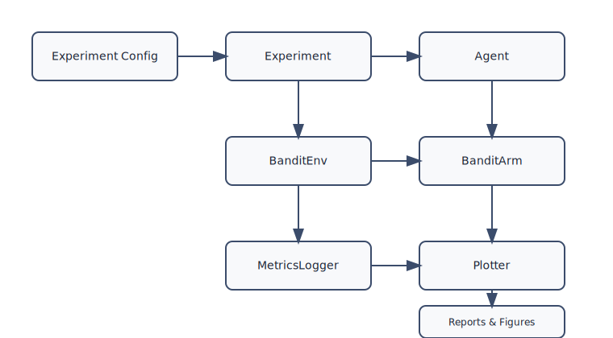
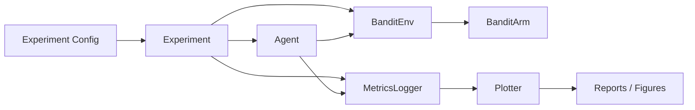

# Multi-Armed Bandits Design

## Goals
- Provide a flexible sandbox for investigating $k$-armed bandit strategies (ε-greedy, optimistic, UCB, Thompson sampling, gradient bandits, etc.).
- Support rapid experimentation across different reward distributions, agent hyperparameters, and horizons.
- Produce reproducible metrics and plots (reward, regret, optimal-action probability) for each experiment.

## Core Abstractions
| Component | Responsibilities |
| --- | --- |
| `BanditArm` | Encapsulates the true reward distribution (Bernoulli, Gaussian, etc.) and handles random sampling.|
| `BanditEnv` | Stores a list of `BanditArm` objects, exposes `pull(arm_index)` to return sampled reward, and tracks which arm is optimal for regret calculations.|
| `Agent` (abstract) | Defines `select_arm(timestep)` and `update(arm_index, reward)`; concrete subclasses implement specific strategies.|
| `Experiment` | Orchestrates multiple episodes/runs, mediates agent–environment interaction, and logs metrics.|
| `MetricsLogger` | Aggregates per-step data (reward, regret, action counts) and writes CSV/Parquet artifacts for later analysis.|
| `Plotter` | Loads saved metrics and renders standard figures with confidence intervals.|

### Dependency Flow

## Proposed File & Function Layout
- `multi_armed_bandits/__init__.py`
  - Expose the primary entry points (`ExperimentConfig`, `run_experiment`, agent factories) for convenient imports.

### Core Modules
| File | Key APIs | Inputs | Outputs | Notes |
| --- | --- | --- | --- | --- |
| `config.py` | `load_config(path: Path)`, `ExperimentConfig.validate()` | YAML/JSON path, dataclass fields | `ExperimentConfig`, raises on invalid setup | Central schema for env/agent/hyperparameter settings. |
| `bandit_env.py` | `BanditArm.sample(rng: np.random.Generator)`, `BanditEnv.pull(arm_index: int, rng: np.random.Generator)`, `BanditEnv.optimal_arm()`, `BanditEnv.reset(seed: int)` | Arm index, RNG, seed | Reward `float`, optimal arm `int`, None | Encapsulates reward draws and provides convenience queries. |
| `agents/base.py` | `Agent.reset(num_arms: int, seed: int)`, `Agent.select_arm(timestep: int)`, `Agent.update(chosen_arm: int, reward: float)` | Horizon step, reward feedback | Selected arm `int`, None | Abstract protocol enforced by all agents. |
| `agents/epsilon_greedy.py` | `EpsilonGreedyAgent.decay_epsilon(timestep: int)` | Step index | Updated epsilon `float` | Maintains ε schedule before delegating to `select_arm`. |
| `agents/ucb.py` | `UcbAgent.upper_confidence_bounds(step: int)` | Step index | Array of UCB values `np.ndarray` | Recomputes bonuses before argmax selection. |
| `agents/thompson.py` | `ThompsonSamplingAgent.sample_posteriors(rng)` | RNG | Posterior samples `np.ndarray` | Draws from Beta/Gaussian posteriors per arm. |
| `agents/gradient.py` | `GradientBanditAgent.preferences()` | — | Preference vector `np.ndarray` | Exposes raw preferences for diagnostics. |
| `metrics/logger.py` | `MetricsLogger.record(step: int, arm: int, reward: float, optimal: bool, regret: float)`, `MetricsLogger.aggregate()`, `MetricsLogger.save(path: Path)` | Step metadata, output path | Pandas `DataFrame`, artifact path `Path` | Handles per-step capture, aggregation across runs, and persistence. |
| `experiment.py` | `run_experiment(config: ExperimentConfig, agent_factory: Callable)`, `run_suite(configs: Iterable[ExperimentConfig])` | Config(s), agent constructor | `ExperimentResult`, list of results | Drives env/agent loop, returns traces + summary stats. |
| `results.py` | `ExperimentResult.to_dataframe()`, `ExperimentResult.summary()` | — | DataFrame, dict of aggregates | Lightweight container for downstream consumers. |
| `plotting/plots.py` | `plot_metric(metric_df: pd.DataFrame, metric: str, out_path: Path, ci: float = 0.95)`, `plot_arm_histogram(metric_df, out_path)`, `plot_hparam_sweep(results: list[ExperimentResult], metric: str, out_path: Path)` | Metrics data, metric name, CI width | Saved figure path `Path` | Standardized plotting helpers for CLI/notebook use. |
| `scripts/run_experiment.py` | `build_parser()`, `main(args: argparse.Namespace)` | CLI args | None (writes logs/figures) | CLI entry point for running experiments defined in configs. |
| `scripts/plot_results.py` | `build_parser()`, `main(args)` | CLI args referencing saved metrics | None (writes figures/reports) | Batch plotting without rerunning experiments. |
| `tests/test_agents.py`, `tests/test_env.py`, `tests/test_experiment.py` | Pytest cases + fixtures | — | Pass/fail | Validate update rules, reward sampling, and smoke-test the runner. |

### Supporting Assets
- `configs/*.yaml`: sample experiment definitions; each file maps directly to `ExperimentConfig`.
- `figures/` (generated): houses PNG/SVG/HTML artifacts created by `plotting`.
- `notebooks/` (optional): exploratory analyses that import the package APIs described above.

## Configuration
- Represent experiment settings with a structured config object (dataclass or YAML): number of arms, reward distribution specs, horizon, number of runs, random seeds, agent parameters (e.g., ε initial/decay, optimism value, UCB confidence `c`, Beta priors).
- Allow batch sweeps via an iterable of configs so you can compare agents or hyperparameters in one CLI invocation.

## Experiment Flow
1. **Initialization**: Build the environment from config (instantiate each `BanditArm` with its parameters), instantiate an agent per config, reset seeds/loggers.
2. **Loop** (per run, per timestep):
   - `arm = agent.select_arm(t)`
   - `reward = env.pull(arm)`
   - `agent.update(arm, reward)`
   - `logger.record(t, arm, reward, optimal_arm_flag, regret)`
3. **Aggregation**: After `n_runs`, compute mean/median and std/CI for all tracked metrics; persist both raw traces and aggregates.
4. **Reporting**: Trigger plotting or produce a Markdown/HTML summary referencing generated figures.

## Metrics to Track
- Instantaneous reward and cumulative reward.
- Optimal-arm indicator (1 if chosen arm matches env optimum) to estimate probability of optimal action.
- Instantaneous regret (`μ* - reward`) and cumulative regret.
- Arm-selection counts/frequencies for diagnosing exploration.
- Agent-specific diagnostics (e.g., ε value after decay, UCB confidence bounds, Thompson samples) when helpful for debugging.

## Plotting Guidelines
- Use Matplotlib/Seaborn or Plotly; central helper should accept metric arrays, x-axis label, title, and output path.
- Standard plots:
  - Average reward vs. timestep with shaded 95% CI.
  - Cumulative regret vs. timestep.
  - Probability of optimal action vs. timestep.
  - Arm-selection histogram/bar plot per agent.
  - Hyperparameter sweep plots (e.g., different ε decay rates) with consistent color palette.
- Store figures under `figures/{agent}/{metric}.png` (or `.html` for interactive), ensuring directories auto-create.

## Testing & Validation
- **Deterministic tests**: Mock reward draws to validate agent update rules (e.g., UCB confidence formula, Thompson Beta posterior update).
- **Smoke tests**: Run a tiny experiment (k=2, horizon=50) during CI to confirm the pipeline runs end-to-end and produces expected files.
- **Plot verification**: Feed synthetic metric tensors into the Plotter to ensure figure generation works even without running full experiments.

## Future Extensions
- Contextual bandits by extending `BanditEnv` to emit feature vectors and conditioning agent policies.
- Dashboard/Notebook integration for interactive exploration of logged metrics.
- Parallel execution (multiprocessing or Ray) for large sweep grids.
- Reward distributions beyond stationary Bernoulli/Gaussian (e.g., non-stationary drift, heavy-tailed).
